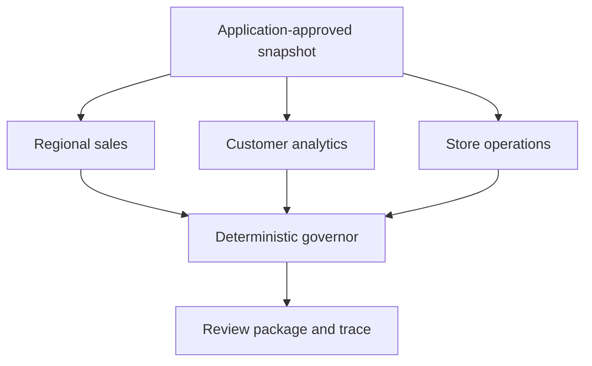

# Bounded multi-agent collaboration

Three business specialists review application-approved evidence in parallel. Deterministic controls assess their proposals, preserve useful findings, and withhold conflicting claims. The output is an executive review package with provenance and explicit limitations. It never authorizes spending.

The concrete adversarial case is the repository's existing $100 order with three line items. In the `invalid` fixture, the regional specialist proposes $300. The governor blocks that proposal while retaining the supported customer and store findings. The result explicitly requires review rather than silently reporting full success.

## Architecture



The application binds each task to the existing registry and role/capability policy. Models receive a single read-only `read_fact` tool for their assigned facts. They receive no SQL interface, warehouse connection, customer names, email addresses, peer-routing tool, or spending tool.

Every candidate is checked against its scoped source value, metric, grain, time basis, fact/scenario kind, required restrictions, and authorized capability. Canonical claims come from the application-owned evidence; the model's original wording remains in the artifact for inspection. Eligible envelopes pass the existing `forecasting_input` routing gate. The demo stops at that boundary and does not execute the forecasting, planning, or CapEx chain.

Reconciliation groups eligible claims by semantic identity, including scope and time basis. Different values for the same identity cause all conflicting claims to be withheld. Agreement preserves the contributing envelopes and their provenance; it grants no additional authority. Missing or blocked specialist coverage forces `REVIEW_REQUIRED`, even when other specialists produce useful results.

This implementation is bounded, application-coordinated collaboration. It demonstrates concurrent specialists and governed synthesis. It does not demonstrate a self-organizing swarm, peer negotiation, independent discovery of new evidence, or autonomous delegation.

The regional and store totals use the same captured warehouse evidence. Agreement between those specialists is not independent source corroboration.

## Run in PyCharm

1. Open this repository as a PyCharm project and select a Python 3.12+ virtual environment as its interpreter.
2. From PyCharm's terminal, install the extension's pinned dependencies:

   ```bash
   python -m pip install -r requirements-collaboration.txt
   ```

3. Create a Python run configuration with **Module name** `collaboration`, the repository root as the **Working directory**, and these **Parameters**:

   ```text
   demo --scenario invalid --compare --output collaboration-artifacts/invalid-01.json
   ```

4. Run it. Alternatively, use this terminal command:

   ```bash
   python -m collaboration demo --scenario invalid --compare --output collaboration-artifacts/invalid-01.json
   ```

The fixture mode uses the local synthetic warehouse and needs no API key or network access after dependencies are installed. The command rebuilds that generated warehouse; do not point the fixture builder at a production database. Install dependencies and run the tests before traveling, then the demonstration works offline.

Each artifact path must be new. A comparison also writes `invalid-01-sequential.json` beside the parallel artifact. Earlier evidence is never overwritten.

```bash
python -m collaboration verify collaboration-artifacts/invalid-01.json
python -m unittest discover -s tests -v
```

Use `--scenario clean`, `invalid`, `timeout`, or `conflict`. Keep a different output name for each run.

| Fixture | Expected review result | Evidence retained |
|---|---|---|
| `clean` | `READY_FOR_REVIEW` | Four supported envelopes from three specialists |
| `invalid` | `REVIEW_REQUIRED` | $300 fanout proposal blocked; three supported envelopes retained |
| `timeout` | `READY_FOR_REVIEW` after recovery | First store attempt times out; bounded retry succeeds |
| `conflict` | `REVIEW_REQUIRED` | Injected $100/$120 source disagreement withheld; unrelated findings retained |

The $120 observation is explicitly injected to test contradiction handling. It is not a warehouse result. Customer findings describe September sales of the **currently classified VIP cohort**, not historical VIP membership. Store-region evidence describes a current assignment, not a historical assignment.

## Optional live SDK execution

Set `OPENAI_API_KEY` and `OPENAI_MODEL` in your local PyCharm run configuration, then use:

```bash
python -m collaboration demo --mode live --output collaboration-artifacts/live-01.json
```

Alternatively, select the model with `--model`. Model choice is explicit; there is no silently selected default. Keep credentials out of the repository and artifacts. SDK tracing is disabled and response storage is disabled, but live mode sends the scoped synthetic facts to the model provider. Those client settings do not establish a general provider retention guarantee.

The adapter runs the actual SDK `Agent`, `Runner`, scoped function tool, and structured output schema. The coordinator owns retries; SDK and HTTP client retries are disabled. Timeout and transient transport failures may be retried. Malformed output, permission errors, and other failures remain visible and are not retried.

Live mode deliberately excludes fixture fault injection and sequential comparison. This change has been validated with offline fixtures and an injected SDK model transport. No live-model behavior, live latency improvement, or provider cost claim follows from those tests.

## Bounds and evidence

| Control | Default |
|---|---|
| Concurrent specialists | 3 |
| Attempts per specialist | 2 |
| Total specialist runs | 6 |
| SDK model turns per attempt | 3 |
| Requested output tokens per model call | 1,000 |
| Candidate claims per reply | 4 |
| Timeout per attempt | 0.08 seconds for fixtures; 30 seconds for live mode |

Each run records task inputs, input digests, attempts, failures, candidate claims, assessment reasons, conflicts, accepted envelopes, and a monotonic event trace. Cancellation drains active tasks. A retry receives the same immutable task input. A recovered run preserves its earlier timeout or transient failure.

`--compare` runs fresh fixture backends with parallel and sequential scheduling, checks identical review decisions, and reports elapsed time and peak in-flight work. Fixture delays are simulated. Timing demonstrates the scheduler's overlap, not a measured model speedup. The concurrency test also uses a barrier that can complete only when all three specialists have started.

`verify` checks the artifact checksum, reconstructs the decisions against the captured facts and current policy/code, and checks task/attempt bindings and execution accounting. The committed [parallel invalid fixture](../evals/collaboration_invalid_fixture.json) and [sequential baseline](../evals/collaboration_invalid_fixture-sequential.json) are replayed and compared in CI. A hash is not a signature: replay does not independently authenticate the actor or re-query the warehouse. Changed control policy can invalidate old evidence.

These are execution bounds, not a hard monetary budget. Token settings bound requested output per call; input tokens, provider pricing, and cancellation after a provider accepts a request still affect cost. Timeouts use cooperative async cancellation. No model-side write tools exist in this demo, so retries do not repeat external business mutations.

## Validation scope

The tests attack financial fanout, semantic substitution, temporal drift, fabricated evidence references, removed restrictions, capability escalation, spending authority, contradictions, timeout exhaustion, cancellation, malformed replies, policy changes, and artifact tampering. SDK tests use the real runner and tool invocation with an offline `Model` implementation to validate scoped access, structured output, and the turn limit.

The existing control evaluation and persisted adversarial scorecard remain separate evidence. The original local `agents/` namespace was moved to `platform_agents/` because the SDK owns the `agents` import. Its implementation and persisted model observations are otherwise preserved.

This remains a synthetic architecture prototype. Application role binding is not production authentication. Aggregate-only payloads are not a demonstrated anonymization guarantee, particularly for small cohorts. Signed evidence, minimum-cohort privacy rules, service identity, and durable production scheduling require separate implementation and validation.
